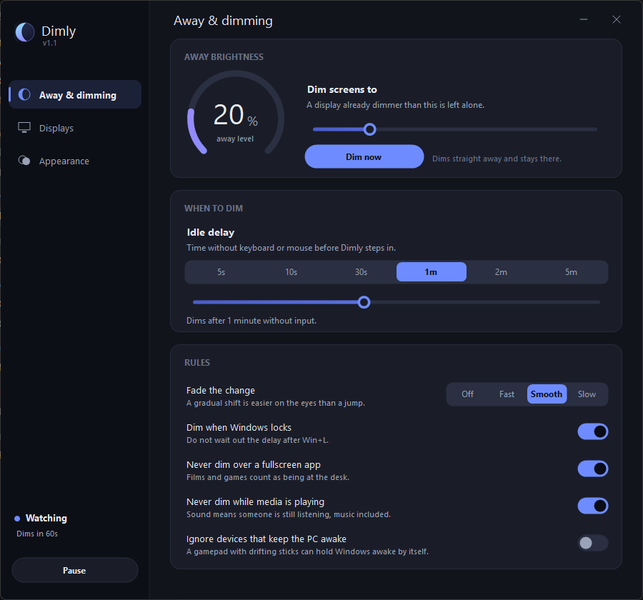
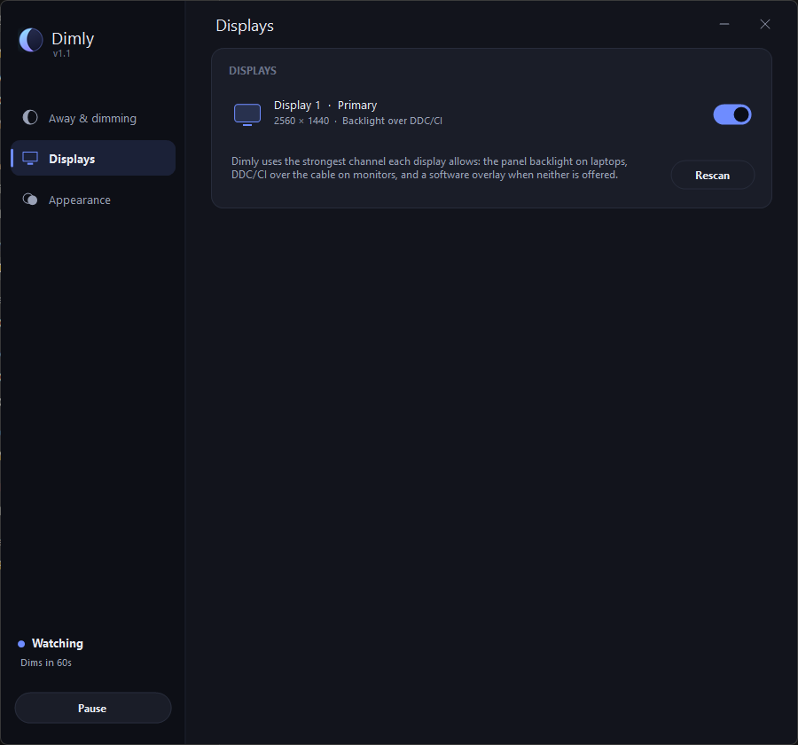
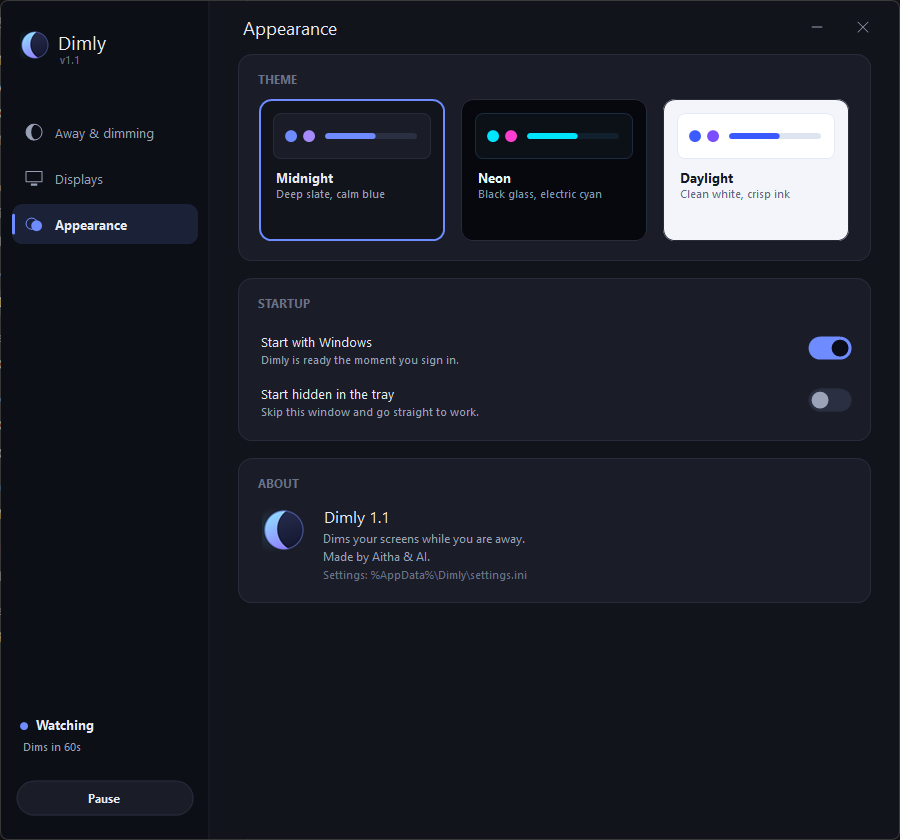
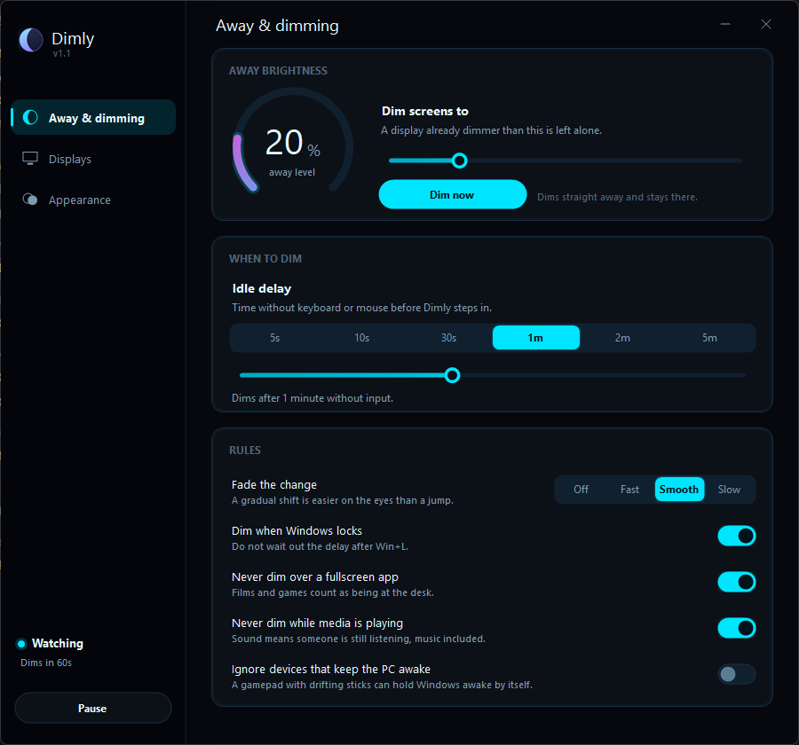
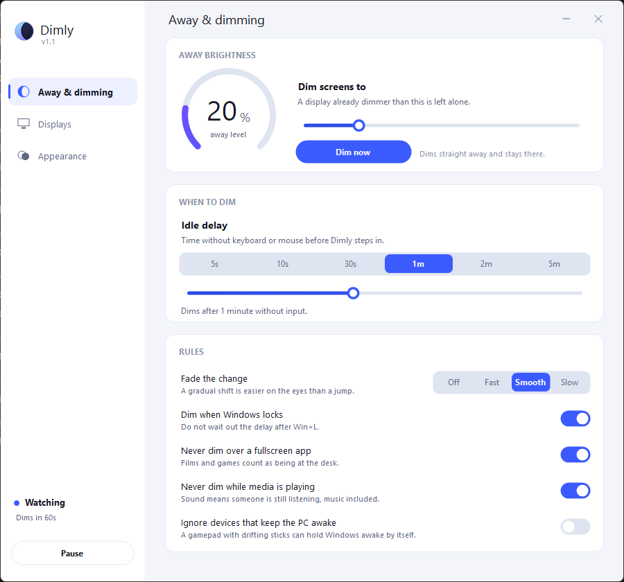

<div align="center">


# Dimly

**Dims your screens while you are away, and puts them back the moment you return.**

One file. No installer, no runtime download, no background service.

[](../../releases/latest)




</div>

---

## Why

Walking away from a bright monitor wastes power and burns backlight hours, and every "dimmer"
utility either needs an installer, drags in a runtime, or just throws a black sheet over the
screen. Dimly is a single 366 KB executable that turns the *actual* backlight down and puts
your exact previous brightness back when you sit down again.

## Features

- **Dims when you leave.** After an idle delay you choose, screens fade down to your away level.
- **Restores exactly what you had.** Not a guess, not a default — the brightness read at the
  moment it dimmed.
- **Dim on demand.** *Dim now* drops the screens straight away and holds them there, ignoring
  the mouse, until you press *Restore brightness*. Good for reading or watching in the dark.
- **Waits while you are watching.** With *Never dim while media is playing* on, the countdown
  does not even start until playback stops — then it begins from that moment, so pausing a film
  gives you the full delay rather than an instant dim.
- **Real backlight control**, not an overlay, wherever the hardware allows it — see below.
- **Multiple monitors**, each handled through the best channel it supports, switchable
  individually — verified dimming and restoring two monitors together.
- **Laptops and desktops.** Internal panels and external monitors both work.
- **Costs almost nothing to run:** measured at **5.4 MB of memory and 0 ms of CPU across 40
  seconds idle**. With media detection on it is 11.7 MB and 16 ms per 40 s — 0.04% of one core —
  because using the Windows audio APIs pulls the audio stack into the process.
- **Three themes**, a proper settings window, and a tray icon that stays out of the way.

## Install

1. Download `Dimly.exe` from the [latest release](../../releases/latest).
2. Put it anywhere you like — a folder you own, a USB stick, wherever.
3. Run it.

That is the whole installation. .NET Framework 4.8 is already part of Windows 10 and 11, so
there is nothing else to fetch. Dimly writes one small text file to
`%AppData%\Dimly\settings.ini` and nothing else; delete the exe and that file and it is gone.

> Windows SmartScreen will say it does not recognise the app, because the executable is not
> code-signed. Choose **More info → Run anyway**, or build it yourself in one command — see
> [Building](#building) and [the note below](#windows-says-it-does-not-recognise-this-app).

## How brightness is actually changed

This is the part that decides whether an app like this works on your hardware. Dimly probes
each display at startup and picks the strongest channel it will accept:

| Display | Channel | Real backlight? |
| --- | --- | --- |
| Laptop and all-in-one panels | WMI, `WmiMonitorBrightnessMethods` | **Yes** |
| External monitors | DDC/CI over the video cable, `dxva2.dll` | **Yes** |
| Anything that refuses both | A click-through black overlay | No, but it always works |

If a monitor advertises DDC/CI and then rejects the write — common with cheap cables, KVMs and
some docks — Dimly notices the failure and moves that display to the overlay by itself. The
Displays page always shows which channel is genuinely in use, so you are never guessing.

Dimly only ever **darkens**. A display already dimmer than your away level is left alone; it
will never brighten a screen you deliberately turned down.

## Screenshots

<table>
<tr>
<td width="50%"></td>
<td width="50%"></td>
</tr>
<tr>
<td align="center"><b>Displays</b><br>Every screen, the channel it really uses, and a switch each.</td>
<td align="center"><b>Appearance</b><br>Three themes, startup options, and where settings live.</td>
</tr>
</table>

### Themes

| Midnight | Neon | Daylight |
| :---: | :---: | :---: |
|  |  |  |
| Deep slate, calm blue | Black glass, electric cyan | Clean white, crisp ink |

## Settings

**Away & dimming**

| Setting | What it does |
| --- | --- |
| Away brightness | 0–100%. The *Dim now* button applies it immediately so you can judge it. |
| Idle delay | Presets from 5s to 5m, plus a slider covering 5 seconds to 30 minutes. |
| Fade | Off, fast, smooth or slow. |
| Dim when Windows locks | Dims on Win+L instead of waiting out the delay. |
| Never dim over a fullscreen app | Films and games count as being at the desk. A merely *maximised* window does not count. |
| Never dim while media is playing | Holds the countdown while the machine is making sound. |
| Ignore devices that keep the PC awake | Counts real keyboard, mouse and gamepad use instead of the system idle clock. |

**Displays** — switch any display in or out. Per-display choices are keyed to the monitor's
hardware ID, so they survive reboots and reconnections.

**Appearance** — theme, start with Windows, start hidden in the tray.

**Tray menu** — Open, Dim now / Restore brightness, Pause, Exit. Double-click the icon to open
the window. Closing the window leaves Dimly running; only Exit quits, and it restores every
display on the way out.

## Windows says it does not recognise this app

That prompt is SmartScreen, and it is a *reputation* warning rather than a malware detection.
For an unsigned file, reputation is tracked per file hash and starts at zero for every new
build, so a small utility that few people download never accumulates any. Microsoft's own
guidance is that new binaries need "several weeks and hundreds of clean installs" before the
warning stops.

Two things are worth knowing before spending money on it:

- **A certificate is not a bypass.** Microsoft removed the behaviour where an EV certificate
  granted immediate reputation in 2024; EV and OV now build reputation the same way. Signing
  helps because reputation then accrues to the *certificate* and carries across versions,
  instead of resetting with every release.
- **The cheap options have conditions.** [SignPath Foundation](https://signpath.io/solutions/open-source-community)
  signs qualifying open-source projects for free, though the publisher shown is "SignPath
  Foundation" rather than your own name. [Azure Artifact Signing](https://azure.microsoft.com/en-us/products/artifact-signing)
  is about $10 a month, but as of February 2026 individual developers are limited to the US and
  Canada. A traditional OV certificate is a few hundred pounds a year and now requires the key
  to live on a hardware token or in a cloud HSM.

### What VirusTotal says

A build of 1.1 scores **3 of 60**. All three are machine-learning verdicts rather than
signatures, which is what the suffixes tell you: Microsoft `Trojan:Win32/Wacatac.B!ml`
(`!ml` = machine learning), Trapmine `Suspicious.low.ml.score` (its own confidence is "low"),
and SecureAge, an ML-only engine. Every signature-based engine, and every other major vendor,
returns clean. `Wacatac` is Microsoft's generic bucket for "unfamiliar Windows executable",
and small unsigned .NET utilities land in it routinely.

The fix is to report it rather than to change the program. Microsoft's
[file submission portal](https://www.microsoft.com/en-us/wdsi/filesubmission) takes a
false-positive report from the developer; choose the *software developer* route, mark it as an
incorrect detection, and give the URL of the source repository. Submissions are typically
resolved in a few days, though the queue is sometimes slower.

What Dimly does so that it has as little as possible to be suspicious about:

- **No hooks.** Activity is read through Raw Input. `SetWindowsHookEx(WH_KEYBOARD_LL)` is the
  API every keylogger reaches for, and installing one across the machine is the single most
  heuristic-tripping thing a small utility can do. Dimly asks Windows to post notifications to
  one private window instead, and only ever looks at which kind of device sent them.
- **No packer, no obfuscator**, no self-extraction, no downloading of anything at runtime.
- **A real version resource and an explicit manifest**, requesting `asInvoker` — Dimly never
  asks for administrator rights.
- **One command to build it yourself**, from source you can read, with `build.ps1` printing a
  SHA-256 you can compare against whatever you downloaded.

## How "media is playing" is decided

Dimly asks the Windows audio engine, walking every active render session and reading its peak
meter. That covers anything that makes sound — a video in a browser tab, VLC, PotPlayer, MPC,
a music player — without needing to know anything about those programs, and pausing genuinely
stops the stream, which is the signal the feature turns on.

A session has to be both **active** and **audible**. Programs that hold the audio device open
feeding digital silence are common — chat apps, some games — and counting those as playback
would mean the screen never dimmed again. An audible moment keeps counting for a few seconds
afterwards, so the quiet beat between two lines of dialogue does not read as "stopped".

Two things follow from this, and neither is a bug:

- **Music counts.** Dimly hears sound, not pictures; it cannot tell a film from a playlist. If
  you listen while you work and still want the screen to dim, turn the toggle off.
- **A muted video does not count.** Nothing is coming out of the audio engine, so there is
  nothing to notice. The *Never dim over a fullscreen app* rule still covers a fullscreen one.

`tools/audioprobe.cs` prints exactly what Dimly hears, once a second, if you ever need to work
out why a particular player is or is not being noticed.

## When Windows never reports any idle time

Everything that waits for you to leave - the screen saver, the display timeout, Dimly - asks
Windows the same question, `GetLastInputInfo`. Any HID report at all resets it, which is fine
until a device reports on its own. **A game controller with drifting analogue sticks is the
usual culprit**: a single unit of flicker on an axis, sixty times a second, pins the system
idle time at zero forever. Nothing dims, nothing sleeps, and no setting in Windows fixes it.

Turning on **Ignore devices that keep the PC awake** makes Dimly stop trusting that clock and
count what a person actually did instead: keyboard and mouse events, and gamepad movement past
a deadzone wide enough to swallow drift but far below a deliberate push of a stick. A
controller resting on the desk goes quiet; one being played with still counts as somebody
being there.

It is off by default because the system clock is the right answer on a healthy machine, and
because input typed into a program running **as administrator** is not visible to a normal
program like Dimly - with this on, a long spell of typing in an elevated window and nothing
else could let the screen dim. Moving the mouse brings it straight back.

If you are not sure whether this is your problem, `tools/whynot.ps1` will tell you: it prints
the idle clock, both dimming rules and the foreground window once a second, and writes the same
to a file on your Desktop so you can read it after walking back.

## Safety

Dimly hands your displays back before it goes away, whatever the reason: a normal exit, Windows
signing out or shutting down, waking from sleep, a monitor being unplugged, or an unexpected
crash. If it ever does crash, it writes the stack trace to `%AppData%\Dimly\crash.txt` and tells
you where to find it, because "it just vanished" is not a bug report anyone can act on.

## Building

You need nothing but Windows. Dimly targets .NET Framework 4.8 and is compiled by the compiler
that ships with it, so there is no SDK, no NuGet restore and no project file.

```powershell
powershell -ExecutionPolicy Bypass -File build.ps1
```

The result is `dist/Dimly.exe`, about 366 KB, with the icon and the version resource embedded. Add `-Run` to launch it
straight after building. The icon itself is generated from code by
`tools/make-icon.ps1` — there are no binary art assets to trust.

Targeting Framework 4.8 rather than .NET 8 is a deliberate trade: it is what makes a genuinely
single-file, install-free 366 KB executable possible, where a modern .NET build would be either
a ~150 MB self-contained file or a runtime download. The cost is C# 5 language level.

## Tests

```powershell
powershell -ExecutionPolicy Bypass -File tools/test.ps1
```

That runs the checks that need nobody at the keyboard:

- **38 checks against the real `DimEngine`** — dimming, restoring, pause, lock and unlock, the
  manual override, the fullscreen guard, the media hold, the stuck-idle-clock workaround,
  per-display exclusion and shutdown — with stand-ins for the Win32 idle clock, the audio
  engine and the hardware, so the code under test is the shipping code.
- **3 checks on fullscreen detection**, against real windows: a borderless window filling the
  monitor is fullscreen, a maximised ordinary window is not, and a small window is not.
- **Display enumeration** against whatever is actually plugged into the machine.

Three more scripts move real screen brightness, so they are kept separate. Each puts your
displays back if anything goes wrong.

```powershell
powershell -ExecutionPolicy Bypass -File tools/functest.ps1    # Dim now, measured over DDC/CI
powershell -ExecutionPolicy Bypass -File tools/idletest.ps1    # the automatic idle path
powershell -ExecutionPolicy Bypass -File tools/mediatest.ps1   # plays a tone, checks it holds off
powershell -ExecutionPolicy Bypass -File tools/multitest.ps1   # every display at once
powershell -ExecutionPolicy Bypass -File tools/devicetest.ps1  # dims despite a stuck idle clock
powershell -ExecutionPolicy Bypass -File tools/restore.ps1     # safety net: all displays to 100%
```

Two diagnostics rather than tests: `tools/whynot.ps1` shows every input the decision is made
from, and `tools/inputspy.cs` counts raw input events to work out what is resetting the idle
clock - injected by software, a jittering mouse, or nothing at all (which means a HID device
is doing it).

The two that wait for the machine to go idle refuse to invent a result: if something on the
machine is injecting input continuously — a jiggler, a remote session, a busy peripheral — they
report SKIP rather than a green tick, because nothing that waits for idle can be tested there.

`multitest.ps1` is the interesting one on a multi-monitor desk: it records a baseline for every
display, presses *Dim now*, and then checks that each monitor answering DDC/CI actually dropped
*and* that every monitor that does not answer DDC/CI grew a layered, click-through, on-top
overlay instead — then that all of it came back.

`tools/shoot.ps1` regenerates the screenshots in this file.

## Project layout

```
src/Program.cs         entry point, single instance, crash handling
src/TrayApp.cs         tray icon, menu, Windows session and power events
src/DimEngine.cs       the state machine: when to dim, when to come back
src/Displays.cs        display enumeration and the three brightness channels
src/MediaWatcher.cs    "is this machine making sound?", via the Windows audio engine
src/ActivityWatcher.cs an idle clock that counts only input a person actually produced
src/Native.cs          the Win32 surface
src/AppSettings.cs     the INI in %AppData%\Dimly, and the Run key
src/SettingsWindow.cs  the window, its sidebar and its three pages
src/Controls.cs        the custom-drawn control set
src/Theme.cs           the three palettes and the drawing helpers
src/AssemblyInfo.cs    the version resource Explorer reads, and the only place the version lives
tools/                 icon generator, tests and screenshot harness
```

## FAQ

**It never dims by itself.**
Run `tools/whynot.ps1` — it names the culprit in one column. The two usual answers are *Never
dim while media is playing* holding it (the sidebar says "Media playing"; music counts), or the
idle clock never advancing, which is almost always a game controller with stick drift — see
[the section above](#when-windows-never-reports-any-idle-time). The tray's *Dim now* works
regardless.

**A monitor is listed as "Software overlay".**
It refused both the WMI and DDC/CI routes. Check whether DDC/CI is enabled in the monitor's own
menu (it is often off by default), and note that many KVMs, docks and adapters block it. The
overlay still dims the picture, it just cannot touch the backlight.

**"Never dim over a fullscreen app" seems to block everything.**
Fixed in 1.1. A maximised window overhangs its monitor by the invisible resize border, and if
your taskbar is set to auto-hide the work area is the whole monitor - so any maximised window
looked like a fullscreen one and held the countdown indefinitely. Dimly now tells maximised
apart from fullscreen by their placement and window frame.

**My antivirus flagged it.**
Check which of the two things happened. "Windows protected your PC" is SmartScreen and means
only that the file is not well known yet — see [above](#windows-says-it-does-not-recognise-this-app).
An actual quarantine with a threat name is a false positive worth
[reporting to Microsoft](https://www.microsoft.com/en-us/wdsi/filesubmission); it costs nothing
and is usually fixed quickly. Either way you can build the executable yourself in one command
and compare the SHA-256.

**Where are my settings?**
`%AppData%\Dimly\settings.ini`, a plain text file you can read, edit or delete.

**Does it need admin rights?**
No. It runs as you and only touches your own display settings and your own `HKCU` Run key.

## Changelog

Every release is listed in [CHANGELOG.md](CHANGELOG.md).

## Credits

Made by Aitha & AI.

## Licence

[MIT](LICENSE) — do what you like with it, just keep the copyright notice.
